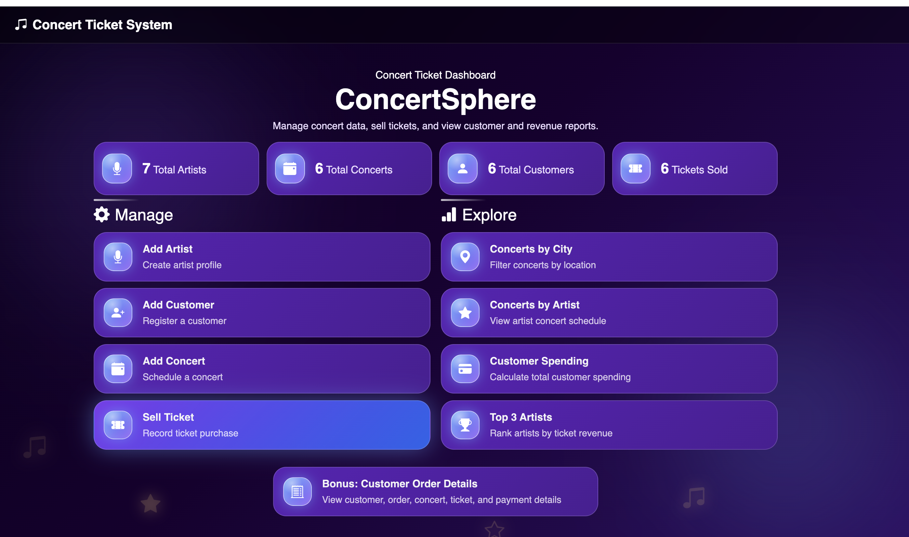
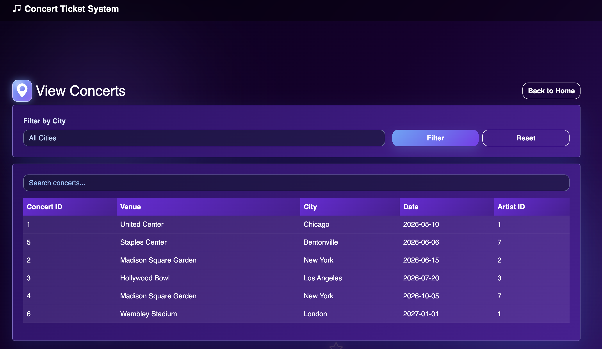

# 🎵 ConcertSphere

## 📸 Screenshots

---

ConcertSphere is a full-stack web application for managing concerts and ticket sales. It allows users to add artists, concerts, customers, and ticket purchases, and also view reports such as customer spending and top-performing artists.

---

## 🚀 Live Demo
👉 https://concertsphere.onrender.com

---

## 🛠️ Technologies Used

- Python (Flask)
- HTML, CSS, Bootstrap
- PostgreSQL
- Render (Deployment)

---

## 📊 Features

- Add Artist  
- Add Concert  
- Add Customer  
- Sell Ticket  
- View Concerts by City  
- View Concerts by Artist (JOIN)  
- Customer Spending (Aggregation)  
- Top 3 Artists by Revenue (Aggregation)  

---

## 🗄️ Database Design

- Artist (ArtistId, ArtistName, Genre)  
- Concert (ConcertId, VenueName, City, ConcertDate, ArtistId)  
- Customer (CustomerId, CustomerName)  
- Orders (OrderId, CustomerId, OrderDate, PaymentMethod)  
- Ticket (TicketId, ConcertId, OrderId, SeatNumber, Price)  

---

## 🌐 Deployment

The application is deployed on Render with a PostgreSQL database.

---

## 📌 Notes

- The app may take a few seconds to load.
- Data is stored in PostgreSQL and persists across sessions.

---

## 👨‍💻 Author

Wahid Sultani
